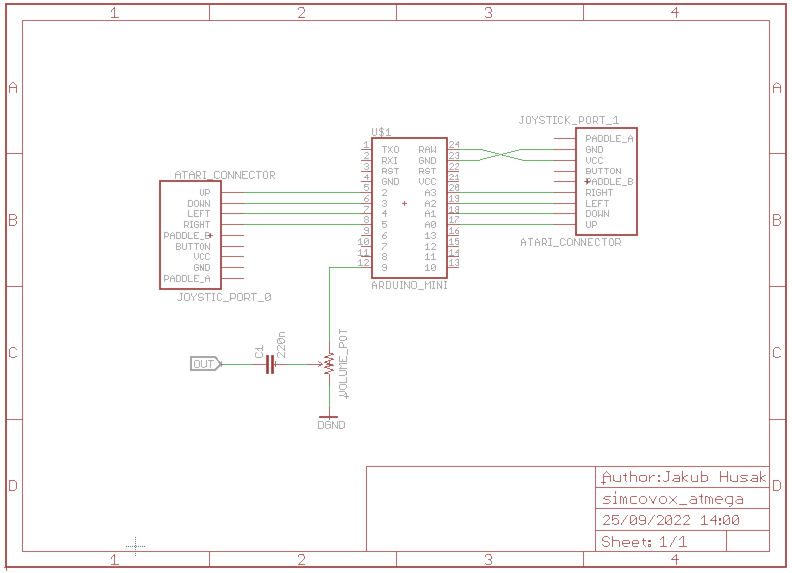

# SimCovox - Atmega arduino mini.

This is simple simcovox for people, who do not like to modify their precious Atari computer.

By using microcontroller, I was able to reach highest 8-bit quality of sound, as we all know,
that Atari8-bit ports are armed with 220 ohm, 1nF capacitors and 10uH solenoids, which makes digital
signals not fully digital for some time. The ordinary attempt - using R-2R ladder caused spikes on
bit flipping and in general spikes everywhere for 1/4/1/5 of one sample time of freq 15600 Hz.
Atmega code filters that out and plays smoothly.

The 8-bit PWM method used in Atmega plays samples with 62.5 khz base frequency, so it is not hearable at all
even for your pets.

The code for Atmega328p was adopted from another project, so some settings are unneccessary.

I do not want to spend more time cleaning up the code, it works as it is.

